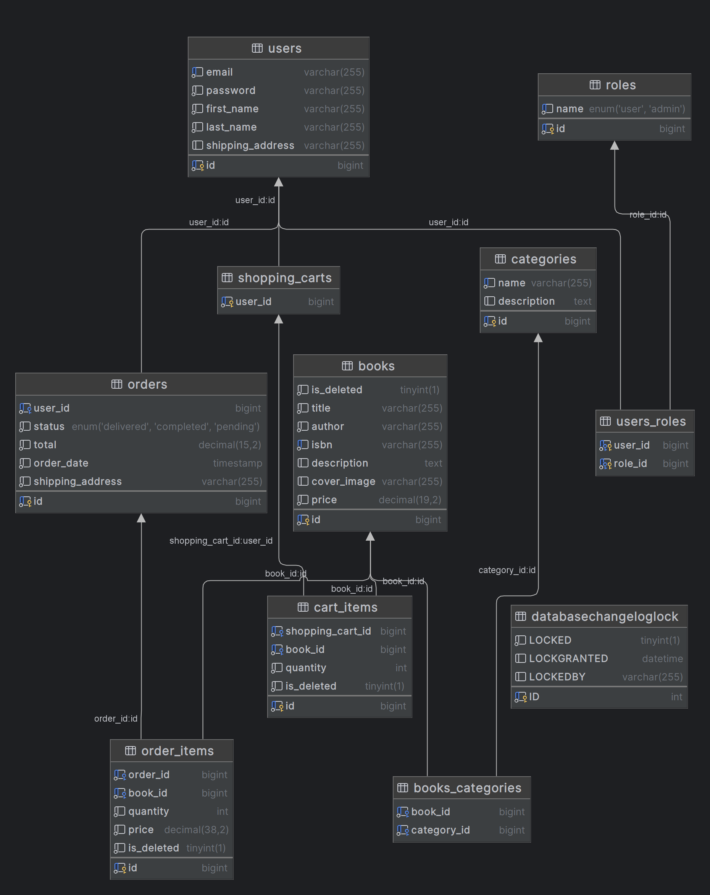

# 
Book Store

Welcome to the Online Book Store project! This is a comprehensive web application designed to provide users with a seamless and engaging experience for browsing, purchasing, and managing books online. Whether you are a casual reader or an avid book collector, this platform aims to meet all your literary needs.

### 
Technologies and tools:

  
<b>Spring Boot</b>

*A framework for building and deploying Java applications with an embedded server, simplifying configuration and accelerating development.*

  
<b>Spring Data JPA</b>

*Part of the Spring Data project, providing an abstraction for working with databases through JPA (Java Persistence API), simplifying interaction with relational databases.*

  
<b>Spring Security</b>

*Framework for securing Spring applications, adding authentication and authorization to protect resources.*

  
<b>Docker</b>

*Platform for automating deployment and managing containerized applications, simplifying work with isolated environments.*

  
<b>JUnit</b>

*A popular testing framework for Java that provides annotations to identify test methods, assertions for testing expected results, and test runners for executing test cases.*

  
<b>Liquibase</b>

*Tool for version control of database schemas, allowing controlled schema changes.*

  
<b>Lombok</b>

*Library that automates code generation to reduce boilerplate cLombok: ode, such as getters, setters, and equals/hashCode.Lombok: ode, such as getters, setters, and equals/hashCode.*

  
<b>Mapstruct </b>

*Library for automatic code generation of mappings between Java objects, simplifying conversion between different models.*

  
<b>Maven</b>

*Tool for managing project dependencies, compilation, building, and publishing of Java programs.*

  
<b>Mockito</b>

*A mocking framework for Java that allows the creation of mock objects in automated tests, facilitating the isolation of code units for more effective testing.*

  
<b>MySQL </b>

*Relational database that uses the SQL language for managing and interacting with data.*

  
<b>Swagger</b>

*A set of APIs provided by Telegram Messenger for building chatbots, integrations, and other applications on the Telegram platform.*

### 
Project structure:

### 
The project has such controllers:

📝🔑**Authentication Controller** - endpoints with open access for new users who want to register and for registered users who want to log in.

| HTTP method |       Endpoint        |           Description           |
|:-----------:|:---------------------:|:-------------------------------:|
|    POST     | `/auth/registration ` |    Register a new customer.     |
|    POST     |    `/auth/login `     | Login as a registered customer. |

:books: **Book Controller** - endpoints for managing books.

| HTTP method |    Endpoint     | Role  |                                Description                                 |
|:-----------:|:---------------:|:-----:|:--------------------------------------------------------------------------:|
|    POST     |    `/books`     | ADMIN |                      Enable admins to add new books.                       |
|     GET     |    `/books`     |  ANY  |                    Provides a list of available books.                     |
|     GET     |  `/books/{id}`  |  ANY  |        Retrieves detailed information about a specific book by id.         |
|     GET     | `/books/search` |  ANY  | Retrieves detailed information about a specific book by search parameters. |
|     PUT     |    `/books`     | ADMIN |               Allows admins to update available book by id.                |
|   DELETE    |  `/books/{id}`  | ADMIN |                    Enable admins to delete a book by id                    |

:clubs: **Category Controller** - endpoints for managing categories.

| HTTP method |            Endpoint            |  Role   |                            Description                            |
|:-----------:|:------------------------------:|:-------:|:-----------------------------------------------------------------:|
|    POST     |         `/categories `         |  ADMIN  |               Enable admins to add new categories.                |
|     GET     |         `/categories`          |   ANY   |             Provides a list of available categories.              |
|     GET     |       `/categories/{id}`       |   ANY   | Retrieves detailed information about a specific categories by id. |
|     PUT     |       `/categories/{id}`       |  ADMIN  |              Allow admins update to category by id.               |
|   DELETE    |     `/accommodations/{id}`     | MANAGER |              Enables the removal of accommodations.               |

:moneybag: **Order Controller** - endpoints for managing bookings.

| HTTP method |                   Endpoint                   |   Role   |                        Description                        |
|:-----------:|:--------------------------------------------:|:--------:|:---------------------------------------------------------:|
|    POST     |                `/api/orders`                 |   ANY    |                Allows user to place order.                |
|     GET     |                `/api/orders`                 |   ANY    |        Provides a list of history orders by user.         |
|     GET     |        ` /api/orders/{orderId/items `        |   ANY    |             Provides a set of items in order.             |
|     GET     | ` /api/orders/{orderId}/items/{orderItemId}` |   ANY    |           Provides a specific item from order.            |
|    PATCH    |              `/api/orders/{id}`              |  ADMIN   |           Allows admins to update order status.           |

:shopping_cart: **Shopping Cart Controller** - endpoints for managing payments.

| HTTP method |              Endpoint               | Role |                     Description                     |
|:-----------:|:-----------------------------------:|:----:|:---------------------------------------------------:|
|    POST     |             `/api/cart`             | ANY  |     Allow users to add item into shopping cart.     |
|     GET     |             `/api/cart`             | ANY  | Provides a list of history shopping carts by user.  |
|     PUT     | `/api/cart/cart-items/{idCartItem}` | ANY  | Allows user to update cart item into shopping cart. |
|   DELETE    | `/api/cart/cart-items-{idCartItem}` | ANY  |       Allows delete item from shopping cart.        |

### 
You can test and use this project:

1. 🚀 Install [Docker](https://www.docker.com/products/docker-desktop/)
2. 📦 Clone [THIS](https://github.com/Stipaxa-hub/store.git) repository
3. 🔧 Configure a "**.env**" file with necessary environment variables
4. 🛠️ Run the command `mvn clean package`
5. 🚢 Use `docker-compose up --build` to build and launch Docker containers
6. 🌐 Access the locally running application at http://localhost:8088

### 
Author:

- 👨‍💻[Stepan Petriv](https://github.com/Stipaxa-hub)
